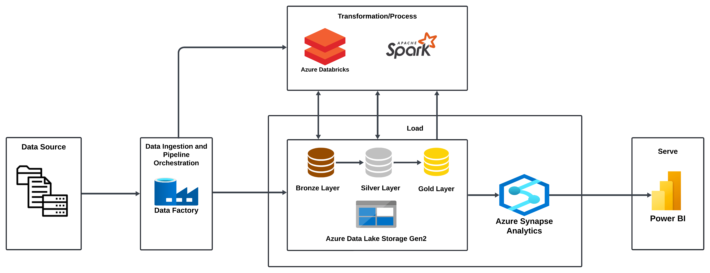

# Azure Data Engineering: Seamless Integration with Data Factory, Databricks, Synapse Analytics, and Power BI
## Table of Contents

1. [Project Overview](#project-overview)
2. [Architecture](#architecture)
3. [Setup](#setup-instructions)
4. [Execution](#execution)

## Project Overview
This project demonstrates a comprehensive data engineering solution implemented on Microsoft Azure. The solution utilizes various Azure services to create a data pipeline, transforming raw data into meaningful insights through a series of well-defined stages. The project follows the Medallion Architecture for data organization and employs Azure Data Factory, Azure Databricks, Azure Synapse Analytics, and Power BI for data visualization.

## Architecture

The architecture of the solution follows the medallion architecture pattern:

1. **Bronze Layer**: Raw data ingestion.
2. **Silver Layer**: Cleaned and processed data.
3. **Gold Layer**: Aggregated and refined data for analysis.

### Azure Services Utilized:

- **Azure Data Factory**: Orchestrating and automating data pipelines.
- **Azure Databricks**: Transforming and processing data using Apache Spark.
- **Azure Synapse Analytics**: Data warehousing and analytics. Azure Synapse Analytics is used for data analysis and querying. It is used to create external tables in serveless SQL pool that references data in Azure Data Lake Gen2. It allows to query data in ADLS from serverless SQL pool without copying it. Any updates done in ADLS, the external table in SQL pool will reflect too. Serverless SQL pool is a query service you use to query data in Azure Data Lake.
- **Azure Data Lake Storage Gen 2**: Storing data at different stages (Bronze, Silver, Gold).
- **Power BI**: Visualizing and reporting data.

### Languages Used:

- **pySpark**: Utilized in Azure Databricks for data transformation.
- **SQL**: Employed in Azure Synapse Analytics for creating external tables and querying analytics.

## Setup

### Prerequisites
- An active Azure subscription.
- Create resource group to manage related resources for the solution as a group.
- Access to Azure Data Factory, Azure Databricks, Azure Synapse Analytics, Azure Data Lake Storage Gen 2, and Power BI.
- Microsoft Integration Runtime on local system to connect to Azure.

### Configuration Steps
#### Storage Account setup (Data Lake Storage Gen2)
1. Create Azure Storage Account (Data Lake Storage Gen2).
2. Create storage containers:
   - Bronze-layer.
   - Silver-layer.
   - Gold-layer

#### Azure Data Factory
1. Create an Azure Data Factory instance 
2. Set up Integration Runtime to connect the local system to Azure Data Factory.
3. Create linked services to Connect ADF to Databricks and ADLS.
4. Create pipelines to orchestrate data movement and transformation tasks.
   - use 'Get Metadata' activity to get the metadata of datasets in JSON format.
   - Use 'foreach' activity to iterate metadata of each JSON file and execute 'copy data' activities in a loop and integrate it with Azure Data Lake Storage.
   - Use databricks to connect to perform transformation on the data in teh workspace.
5. Trigger the pipeline to run.

#### Azure Databricks

1. Create a Azure Databricks workspace.
2. Use pyspark to do the following:
   - Data Ingestion: Read raw data from the Bronze layer.
   - Data Transformation: Clean and process data, moving it to the Silver layer.
   - Data Aggregation: Refine and aggregate data, moving it to the Gold layer.

#### Azure Synapse Analytics

1. Create Azure Synapse worspace.
2. Set up SQL pools(Dedicated or Severless SQL pools). This project uses Severless SQL pools.
3. Data Lake Integration: Connect to ADLS and access data in the Gold layer.
4. External Tables: Create external tables to query data stored in ADLS.
5. SQL Queries: Run analytical SQL queries for data analysis.

#### Power BI

1. Connect Power BI Desktop to Azure Synapse Analytics:
   - Get Data -> Azure -> Azure Synapse Analytics SQL.
   - Fill in SQL Server details(Got to Synapse workspace -> properties ->Copy Serveless SQL endpoint)-> Sign in to Miccrosoft Account to Connect to workspace.
   - Click and Load the data.
2. Create interactive dashboards and reports.

## Execution

1. **Ingest Data**: Use ADF to move raw data into the Bronze layer in ADLS.
2. **Transform Data**: Run Databricks notebooks to process data from Bronze to Silver and Silver to Gold layers.
3. **Analyze Data**: Query the Gold layer data using Synapse SQL.
4. **Visualize Data**: Create and share reports using Power BI.

